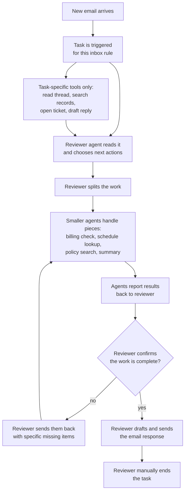

# SharpClaw

> **Alpha.** Single developer, early stage, lots of untested surface area.
> [Read the full disclaimer.](DISCLAIMER.md)

> **Developer notice.** The developer of SharpClaw has been hired to work on
> an undisclosed commercial enterprise tool inspired by this project. Future
> development on SharpClaw will be limited by time and contractual constraints,
> but **the project is not abandoned**. SharpClaw remains open-source under
> [AGPL-3.0](LICENSE.md), and that will not change regardless of what happens
> with the commercial version.

SharpClaw is a local AI agent runtime for building agents that can use real
capabilities without collapsing everything into one ungoverned shell. It
combines provider abstraction, hot-loadable modules, resumable tasks,
permissioned tool execution, persistence, audit trails, and optional desktop
or gateway frontends in one .NET platform.

It can be a permissive solo coding agent, a headless automation server, an
enterprise control plane, a multi-agent workspace, or the runtime behind a
customer-facing AI application. The point is not to make every action painful.
The point is that broad trust and narrow trust can coexist.

| Layer | What It Does | Why It Matters |
| --- | --- | --- |
| Providers | Normalizes OpenAI-compatible APIs, Anthropic, Google, Ollama, LlamaSharp, and custom providers. | Applications keep the same agents, tasks, tools, and permissions while models change. |
| Modules | Hot-loads providers, tools, resources, task steps, gateway routes, metrics, and frontend hooks. | SharpClaw can gain new capabilities without rewriting Core. |
| Tasks | Runs resumable workflows with agent calls, tool calls, loops, branches, shared data, logs, and output streams. | Many intelligent workflows can live inside SharpClaw instead of needing a separate backend. |
| Permissions | Combines roles, resource grants, tool awareness, channel policy, and optional approval. | Trusted agents can be broad; focused agents and user-facing agents can be tightly contained. |
| Persistence | Supports encrypted JSON-file persistence and EF Core-backed relational persistence projects. | Local experimentation and higher-performance enterprise deployments can use the same contracts. |
| Frontends | Exposes Core through the API, optional Gateway, and modular Uno desktop shell. | SharpClaw can run headless, behind a public proxy, or as an extensible local app. |

## Why Use It

Most agent systems give a model a terminal and hope the prompt holds. SharpClaw
turns capabilities into typed actions owned by modules. A model can ask to edit
code, call a browser, run a task, use a provider, or touch a legacy system, but
the host decides what is visible, valid, allowed, approved, executed, logged,
cost-tracked, and persisted.

That makes SharpClaw useful when one agent should edit a project freely, a
helper model should only summarize text, a deployment task should need release
approval, and a customer-facing agent should never see internal tools. A
trusted role can still be broad. The value is that trust is explicit.

## Tasks And Modules

Tasks are SharpClaw's application layer. A task can watch an event, call an
agent, invoke tools, branch on output, store shared data, pause, resume, stream
progress, and return structured results. A compliance review, release
assistant, support triage flow, document intake worker, or build-and-test loop
can be a task instead of a separate service.

Modules are how those tasks and agents get new abilities. A module can expose
Computer Use, a browser, a terminal with custom rules, a medical device API, a
Visual Studio or VS Code bridge, a Neovim adapter, a legacy desktop app, or a
provider that is not OpenAI-compatible. A sufficiently trusted agent can even
help build and hot-load new modules while SharpClaw is running.

## Add Your Own Features

SharpClaw is designed so new capabilities do not have to wait for Core to grow.
Modules put specific features at the edge while Core keeps owning identity,
permissions, persistence, task execution, provider routing, and audit trails.

| Want to add this feature? | Build it as this kind of module |
| --- | --- |
| Computer Use | A desktop-control module with screen capture, mouse, keyboard, policy, approvals, and task steps. |
| A browser agent | A browser module with tabs, navigation, page extraction, downloads, screenshots, and per-site permissions. |
| A Visual Studio, VS Code, or Neovim bridge | An editor module with file context, diagnostics, selections, commands, terminal access, and review tools. |
| A legacy desktop app integration | An app module that wraps COM, IPC, CLI commands, files, windows, or automation hooks as typed tools. |
| A model provider that does not match existing APIs | A provider module with model sync, request translation, streaming, cost data, and parameter validation. |
| A domain workflow such as intake, release, or triage | An automation module with triggers, task steps, shared resources, logs, and optional gateway endpoints. |
| A customer-facing product surface | A gateway or frontend module with routes, UI hooks, background workers, resources, and agent contracts. |
| A capability unique to your team or industry | A purpose-built module with the tools, policies, screens, and task steps your agents need. |

Once a module exists, the same feature can be permissioned, reused, hot-loaded,
audited, exposed to tasks, and shared with other users instead of being trapped
inside one local script.

## Tasks As Structural Backpressure

SharpClaw tasks are C# scripts. In everyday terms, a task is a fixed workflow
that gives an agent the exact tools for one job, watches the handoffs, and
keeps the work from drifting until a real finish condition is reached.

This inbox flow is just one example of that pattern.



The task is the structure around the agent. It decides when the work starts,
which tools are visible, how smaller agents are assigned, what counts as done,
and when the loop is allowed to stop. The same shape can handle technical work
such as release checks, dependency upgrades, incident review, migration
planning, benchmark follow-up, and codebase maintenance, or everyday work such
as support triage, appointment scheduling, invoice follow-up, document intake,
meeting preparation, and status reporting.

## Runtime Shape

| Component | Role |
| --- | --- |
| `SharpClaw.Runtime.BLL` | Agents, chat, jobs, permissions, tasks, modules, providers, costs, and logs. |
| `SharpClaw.Runtime.Host` | HTTP surface over Core for headless and integrated deployments. |
| `SharpClaw.Gateway` | Optional public proxy with endpoint toggles, queueing, rate limiting, and module-contributed routes. |
| `SharpClaw.Client.Uno` | Modular desktop frontend that can host module-provided UI hooks and manage local processes. |
| Packaged modules | Providers, editor bridges, agent orchestration, metrics, and module development tools restored from NuGet package payloads. |
| `SharpClaw.Modules.TestHarness.OutOfProcess` and `SharpClaw.Modules.TestHarness.InProcess` | The only in-repo module sources, kept deliberately as test infrastructure for the two module host modes. |

The currently bundled modules are intentionally focused: Anthropic, Google,
LlamaSharp, Ollama, OpenAI-compatible providers, Visual Studio 2026, VS Code,
Agent Orchestration, Metrics, and Module Development. Older experiments such
as browser control, office automation, Computer Use, and special-purpose
shells are examples of what the module system can host, not guaranteed bundled
features.

## Getting Started

Most users should start from the
[GitHub Releases page](https://github.com/mkn8rn/SharpClaw/releases) instead
of building the project in Visual Studio 2026 or from source. Release archives
are published by runtime shape and by platform, so pick the smallest bundle
that matches how you want to run SharpClaw.

| Release family | Includes | Best fit |
| --- | --- | --- |
| Core | Core API only. | You already have a reverse proxy, service wrapper, or container host and only need the internal API. |
| Server | Core API and Gateway. | You want a headless deployment that can expose public routes, webhooks, bots, or module-contributed gateway endpoints. |
| Uno | Uno desktop client, Core API, and Gateway. | You want the local app experience with the bundled backend and optional gateway managed from the UI. |

Each family is published for supported Windows, Linux, and macOS runtime
identifiers such as `win-x64`, `linux-x64`, `linux-arm64`, `osx-x64`, and
`osx-arm64` when the platform supports that shape.

Developers who want to run from source can still build and start the Core API
directly:

```bash
dotnet build SharpClaw.Runtime.Host/SharpClaw.Runtime.Host.csproj
dotnet run --project SharpClaw.Runtime.Host/SharpClaw.Runtime.Host.csproj
```

Then launch the Uno client separately, create the first admin account, add a
provider, sync models, create an agent, open a channel, and start chatting.
Local environment templates live under each process's `Environment` folder and
are copied into place when no local `.env` exists.

## Documentation

Start with [Core API Reference](docs/Core-API-documentation.md),
[Gateway API Reference](docs/Gateway-documentation.md),
[Tasks Documentation](docs/Tasks-documentation.md), and
[Module Creation Guide](docs/guides/Module-Creation-Guide.md). Provider
settings are covered in [Provider Parameters](docs/Provider-Parameters.md),
and local AppData log files are covered in [Logging](docs/Logging.md).

## License

SharpClaw is licensed under the
[GNU Affero General Public License v3.0](LICENSE.md). Some bundled modules,
generated assets, documentation examples, or third-party components may carry
their own license notices; check the files and package metadata in the part of
the project you are using. Report security issues through
[GitHub Private Vulnerability Reporting](https://github.com/mkn8rn/SharpClaw/security/advisories/new)
rather than public issues.
